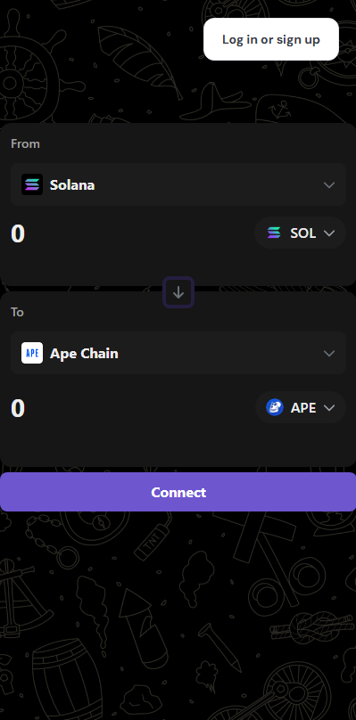

# 🦍 Gorilla Swap – Cross-Chain Token Swapping Platform

Gorilla Swap is a decentralized application (dApp) that enables users to perform seamless cross-chain token swaps. Leveraging the power of the **Relay.link SDK**, Gorilla Swap simplifies the complexities of cross-chain transactions, providing a user-friendly interface for efficient and secure token exchanges.

## 🌐 Live Demo

Experience the platform: [https://gorilla-swap.vercel.app/](https://gorilla-swap.vercel.app/)



## 🚀 Features

- **Cross-Chain Swapping**: Swap tokens across multiple blockchain networks with ease.
- **Relay.link Integration**: Utilizes the Relay.link SDK for efficient and secure cross-chain operations.
- **User-Friendly Interface**: Intuitive design for a seamless user experience.
- **Real-Time Quotes**: Fetches and displays real-time token swap quotes.
- **Wallet Connectivity**: Supports popular wallets for secure transactions.

## 🛠️ Technologies Used

- **Frontend**: Next.js, Tailwind CSS
- **Blockchain Integration**: Relay.link SDK
- **Wallet Integration**: Wagmi, RainbowKit
- **State Management**: React Hooks, TanStack React Query

## 🧰 Getting Started

### Prerequisites

- Node.js (v18 or higher)
- npm or yarn
- A supported cryptocurrency wallet (e.g., MetaMask)

### Installation

1. **Clone the repository**:

   ```bash
   git clone https://github.com/your-username/gorilla-swap.git
   cd gorilla-swap
   ```

2. **Install dependencies**:

   ```bash
   npm install
   # or
   yarn install
   ```

3. **Configure Environment Variables**:

   Create a `.env.local` file in the root directory and add the following variables:

   ```env
   NEXT_PUBLIC_RELAY_API_KEY=your_relay_api_key
   NEXT_PUBLIC_WALLET_CONNECT_PROJECT_ID=your_walletconnect_project_id
   ```

4. **Run the development server**:

   ```bash
   npm run dev
   # or
   yarn dev
   ```

5. **Access the application**:

   Open [http://localhost:3000](http://localhost:3000) in your browser.

## ⚙️ Configuration

### Relay.link SDK Setup

The Relay.link SDK is configured in the application to handle cross-chain swaps. For detailed information on setting up and customizing the SDK, refer to the [Relay.link SDK Documentation](https://docs.relay.link/references/sdk/getting-started).

### Wallet Integration

Gorilla Swap uses Wagmi and RainbowKit for wallet integration, allowing users to connect their preferred wallets securely.

## 📄 License

This project is licensed under the MIT License.

## 🤝 Acknowledgements

- [Relay.link](https://relay.link/) for providing the SDK and APIs for cross-chain operations.
- [Wagmi](https://wagmi.sh/) and [RainbowKit](https://rainbowkit.com/) for wallet integration solutions.
- [Next.js](https://nextjs.org/) and [Tailwind CSS](https://tailwindcss.com/) for the frontend framework and styling.
